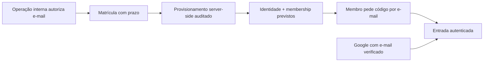

# Definition Pack IAM-2.28 — Onboarding controlado e acesso sem senha

**Status:** FOUNDATION BUILT — operação externa pendente  
**Dependência:** checkpoint `147-GOVERNANCE-CHECKPOINT-IAM-2.28.md` aprovado pelo owner em 2026-08-12.

## Problema que resolve

O Mesa OS não deve exigir que o membro espere um link de e-mail ou trate configurações de autenticação. Ao mesmo tempo, cadastro público e vínculo automático continuam proibidos. O produto precisa separar a operação de autorizar o acesso da experiência simples de entrar.

## Fluxo proposto

## Contratos funcionais

### Matrícula

- É criada somente por operação interna autorizada, sem tela de membro neste incremento.
- Tem `organization_id`, e-mail normalizado, papel, expiração, estado e auditoria de criação/uso.
- É de uso único; revogação e expiração impedem provisionamento.

### Provisionamento

- Confere a matrícula, cria ou localiza a identidade pelo e-mail e cria exatamente o membership previsto.
- É idempotente, restringe a uma organização inicial e registra resultado sem dados sensíveis.
- Não fica exposto em rota pública nem é chamável pelo TutorIA.

### Código por e-mail

- É caminho primário de entrada para identidade já provisionada.
- É temporário, de uso único e segue limites de frequência.
- Resposta é sempre neutra; a aplicação não confirma cadastro, organização ou papel antes da sessão válida.

### Google

- É alternativa futura ativável por ambiente depois de configuração externa e smoke autorizado.
- O e-mail precisa ser verificado pelo provedor e corresponder à identidade previamente provisionada.
- Falha de correspondência não cria usuário, matrícula, vínculo ou organização.

## Decisões que este pack não altera

- ADR-027 (entrada por convite; cadastro público desativado);
- papéis `owner` e `member`;
- uma organização por identidade no primeiro release;
- Terms obrigatórios no primeiro acesso autenticado;
- isolamento organizacional, RLS, auditoria, segredos somente server-side e ambientes separados.

## Gates de entrega

1. Aprovação explícita do owner.
2. Pre-Flight com modelo de ameaça e migration revisada.
3. BUILD somente em branch, com testes de negação e isolamento.
4. Preview/CI sem criação de usuário real.
5. Configuração de Google e envio operacional de e-mail somente após decisão operacional explícita; não se inclui em deploy de código.
