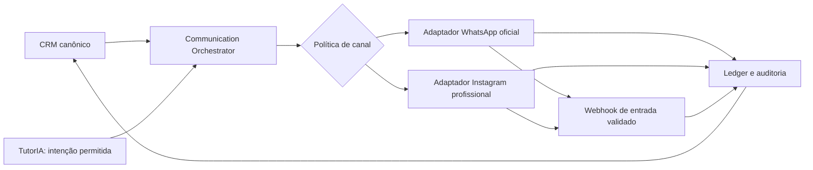

# Definition Pack — Backoffice, CRM e Canais Oficiais

**Status:** APPROVED FOR DEFINITION/DISCOVERY — owner autorizou o avanço em 2026-08-13; não autoriza BUILD

## Objetivo

Definir a futura operação interna da Mesa dos Donos e um CRM de relacionamento que possa operar por interface própria e, quando houver autorização específica, integrar-se aos canais oficiais de WhatsApp Business e Instagram profissional. O CRM deve apoiar Comercial, Concierge e Mentores sem transformar a área do membro em backoffice nem conceder acesso amplo a dados de membros.

## Decisões de fonte consultadas

- `SRC-001` e `docs/63-SOURCE-RECOVERY-MESA-OS-V2.md`: proatividade, escalonamento humano, comunicação governada e WhatsApp oficial.
- `docs/00-CONSTITUTION.md`: menor privilégio, rastreabilidade e ausência de complexidade interna para o membro.
- `docs/02-V2-SCOPE.md`: API oficial para WhatsApp; automação externa passa por consentimento, política, orquestração e auditoria.
- ADR-036, ADR-037 e ADR-039 em `docs/08-ADR-DECISION-LOG.md`.
- `docs/91-DEFINITION-PACK-META-WHATSAPP-READINESS-DRAFT.md`: gateway Meta isolado e nenhuma mensagem direta pelo modelo ou navegador.
- `docs/145-DEFINITION-PACK-MEMBER-EXPERIENCE-AND-INTELLIGENCE-BOUNDARIES.md`: a operação da Mesa é segregada da experiência do membro.
- `docs/159-DEFINITION-PACK-IAM-2.29-SEGREGATED-ACCESS-DRAFT.md`: `/ops` atual é somente uma porta técnica de matrícula, não o backoffice completo.

## Proposta de produto

### 1. Backoffice separado do ambiente do membro

O membro continua em `/app`. A operação interna vive em uma área segregada, com login próprio, permissões por função, trilha de auditoria e navegação orientada ao trabalho interno. A porta técnica de matrículas pode evoluir para essa área, mas não deve ser confundida com um CRM.

Funções internas propostas:

| Função | Responsabilidade inicial | Não recebe por padrão |
| --- | --- | --- |
| Donos/Admins | governança, responsáveis, configurações aprovadas e visão operacional | acesso irrestrito sem auditoria |
| Comercial | leads, oportunidades, atividades e transições comerciais | contexto pedagógico/conversas de membros sem necessidade |
| Concierge | onboarding, pendências operacionais e encaminhamentos | alteração unilateral de metodologia ou progresso |
| Mentor | acompanhamento de carteira atribuída e escalonamentos autorizados | acesso à carteira inteira ou dados de outros mentores |
| TI/Plataforma | saúde de integrações, incidentes, segredos e observabilidade | conteúdo de conversas e dados de negócio por conveniência |
| Operações | matrículas, revogações e rotinas autorizadas | acesso amplo aos dados do CRM |

As permissões serão capabilities mínimas, não apenas nomes de cargo. Uma pessoa poderá ter mais de uma função, mas cada acesso, leitura sensível e ação em nome do membro será atribuível, temporal e auditável.

### 2. Núcleo canônico do CRM

O CRM não deve nascer dependente de WhatsApp, Instagram ou de qualquer fornecedor. Seu núcleo canônico deverá ter, no mínimo:

- organização, contato e origem do relacionamento;
- lead/oportunidade, etapa, responsável, próxima ação e motivo de transição;
- atividade e linha do tempo de relacionamento;
- consentimentos, preferências de canal, bloqueios e regras de retenção;
- encaminhamento entre Comercial, Concierge e Mentor;
- eventos de comunicação com status, sem exigir guardar conteúdo além do necessário;
- relação explícita entre lead e membro somente após conversão/autoridade prevista.

O CRM não altera automaticamente ciclo, missão, evidência, evolução ou memória TutorIA. Qualquer integração com a metodologia exige contrato próprio, política, escopo e auditoria.

### 3. Camada de comunicação portátil

- **Communication Orchestrator:** recebe uma intenção autorizada e decide se ela pode ser enviada conforme finalidade, consentimento, preferências, horário, frequência, cooldown, responsável e escalonamento.
- **Adaptadores de canal:** são as únicas camadas que conhecem APIs e credenciais de fornecedores. WhatsApp e Instagram podem ser substituídos ou complementados sem reescrever o CRM.
- **Ledger de comunicação:** mantém intenção, canal, identificadores externos, status de entrega, falhas, resposta/opt-out e auditoria; conteúdo é minimizado, protegido e submetido à retenção definida.
- **Webhook de entrada:** valida origem e assinatura antes de aceitar qualquer evento. Uma mensagem recebida nunca vira instrução executável por si só.

## WhatsApp e Instagram: condições obrigatórias

1. Somente APIs oficiais da Meta, sem QR code, scraping, automação de navegador ou bibliotecas que simulem cliente.
2. Integração somente por servidor; tokens, segredos e chaves ficam em cofre de segredos por ambiente, nunca em `NEXT_PUBLIC_*`, Git, logs ou interface.
3. Configuração e teste isolados em homologação antes de produção.
4. Regras do canal, identidade profissional, consentimento quando aplicável, opt-out, frequência e janela de comunicação devem ser verificados pelo orquestrador antes de cada envio.
5. Templates, mensagens sensíveis, campanhas e automações proativas exigem política, aprovação e critérios de escalonamento humano próprios.
6. Falhas de entrega, bloqueio, opt-out ou inconsistência de identidade interrompem novos disparos até tratamento apropriado.

## Relação com TutorIA e Mesa OS Intelligence

TutorIA pode produzir uma **intenção** contextual — por exemplo, sugerir que um membro receba ajuda humana —, mas não conversa externamente nem envia mensagens sem passar pelo orquestrador. Ele não recebe acesso direto ao CRM, ao banco ou às credenciais de canal.

Mesa OS Intelligence poderá produzir análises agregadas e desidentificadas para melhorar conteúdos, treinamentos e operação. Uso identificável de dados, cruzamento entre membros, recomendação operacional ou qualquer ação externa requer um pack próprio de finalidade, acesso, retenção, revisão humana e auditoria.

## Limites e privacidade

- Nenhuma integração cria vínculo de membro automaticamente.
- Nenhuma função interna ganha leitura global de dados de membros por padrão.
- Acesso de suporte, visualização de contexto ou atuação em nome de alguém exige motivo, escopo, duração e registro de auditoria.
- Dados de comunicação não são usados para treinar modelos ou outras organizações.
- O CRM preserva titularidade, exportação, retenção e eliminação conforme os Termos, Aviso de Privacidade e decisão jurídica aplicável.
- Limites de custo, taxa, volume e incidentes ficam em configuração versionada e observável pela operação autorizada.

## Entregas propostas para um futuro BUILD

1. Definition Pack específico de RBAC interno, MFA/SSO e trilha de auditoria, com matriz de capabilities.
2. Modelo canônico do CRM, RLS, retenção, exportação e testes de isolamento.
3. Interface interna inicial para Comercial/Concierge, sem acesso implícito a dados sensíveis.
4. Communication Orchestrator e ledger sem canal ativo, com testes de política e idempotência.
5. Adaptador WhatsApp oficial em homologação, webhook validado e testes de opt-out.
6. Adaptador Instagram profissional em homologação, com as regras oficiais vigentes e testes de identidade/entrada.
7. Observabilidade, alertas de falha, orçamento e plano de rollback por canal.

## Fora do escopo deste pack

- BUILD imediato, migrations, tabelas, telas, provisionamento de contas Meta, webhook, tokens ou envio de mensagens.
- CRM público, disparo em massa, automação de vendas ou importação de contatos sem base legal e política aprovadas.
- Acesso de comercial/concierge/mentor a todas as organizações ou conversas.
- Impersonação, edição da metodologia, aprovação de evidências, alteração de ciclos ou autonomia decisória de IA.
- Treinamento/fine-tuning a partir de conversas, mensagens ou dados identificáveis de membros.

## Critérios de aceite para autorização futura

1. A matriz de acesso interno define capabilities, RLS, MFA/SSO, logs e revisão de acesso.
2. O CRM mantém seu núcleo independente de fornecedores de comunicação.
3. Um envio só ocorre após a política validar finalidade, identidade, canal, preferência, limite e opt-out.
4. Webhooks são autenticados, idempotentes e não executam ações de negócio diretamente.
5. Nenhum segredo, conteúdo sensível ou dado entre organizações aparece em logs, navegador ou repositório.
6. Testes comprovam isolamento, revogação, auditoria, falhas, opt-out e rollback de canal.
7. Jurídico/privacidade aprova os textos e a finalidade antes de qualquer comunicação externa em produção.

## Próxima decisão necessária ao owner

Esta aprovação autoriza apenas o detalhamento de arquitetura, riscos, dados, compliance e critérios de aceite. Um pedido futuro deverá autorizar explicitamente o primeiro **BUILD em homologação**. Mesmo com essa autorização, WhatsApp e Instagram exigirão gate separado de configuração Meta, privacidade, testes de webhook e promoção explícita.
