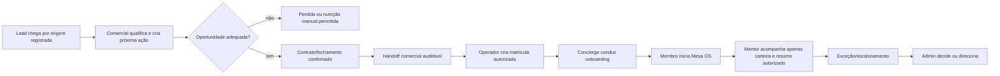

# CRM Operating Model R1 — Equipe, Poderes e Fluxos

**Status:** SUPERSEDED BY R2 — preservado como histórico; ainda sem autorização de BUILD

## Princípio de desenho

O CRM deve ser completo no que a equipe precisa fazer, mas cada pessoa deve enxergar somente o contexto necessário para cumprir seu papel. Um cargo não é uma permissão. O sistema concede **capabilities** temporais, auditáveis e com escopo de carteira.

## Estrutura recomendada da equipe

| Função | Missão | Domínio de trabalho | Limite estrutural |
| --- | --- | --- | --- |
| Dono/Admin | governar operação, pessoas, exceções e qualidade | acesso, carteiras, regras e visão operacional | não lê conteúdo sensível ou atua em nome do membro sem motivo/auditoria |
| Comercial | transformar demanda em contrato adequado | leads, contas, contatos, oportunidades, tarefas e handoff | não acessa contexto metodológico, conversas ou evolução de membros |
| Concierge | fazer a passagem contratada para uma entrada bem-sucedida | onboarding, pendências, comunicação operacional e escalonamentos | não altera metodologia, progresso, avaliações ou memória TutorIA |
| Mentor | acompanhar a carteira atribuída e orientar por exceção | resumo autorizado da carteira, pedidos de ajuda e handoffs | não vê outras carteiras, dados de vendas ou chat bruto |
| Operador | executar rotinas controladas | matrícula, revogação, validade e conferências operacionais | não lê pipeline nem dados de negócio |
| TI/Plataforma | manter disponibilidade e segurança | saúde técnica, incidentes, integrações, auditoria técnica e segredos | não lê conteúdo de CRM/membro por conveniência |

Não é necessário criar um papel separado de “suporte” neste momento: incidentes de acesso pertencem a Operações/TI; orientação de entrada a Concierge. Um papel de **Financeiro** pode ser acrescentado depois, somente se houver cobrança, nota fiscal ou conciliação aprovadas.

## Poderes por capability

| Capability | Admin | Comercial | Concierge | Mentor | Operador | TI |
| --- | --- | --- | --- | --- | --- | --- |
| gerir acessos e atribuições internas | sim, com auditoria | não | não | não | não | não |
| gerir carteira comercial | sim | própria/atribuída | leitura de handoff | não | não | não |
| criar e evoluir lead/oportunidade | sim | própria/atribuída | não | não | não | não |
| registrar atividade, tarefa e próxima ação | sim | própria/atribuída | onboarding atribuído | caso atribuído | matrícula/rotina | incidente técnico |
| transferir handoff comercial | sim | solicita; aprovação conforme regra | aceita/recusa com motivo | não | não | não |
| criar/revogar matrícula | sim | não | solicita | não | executa | não |
| ver envelope operacional do membro | por exceção auditada | não | carteira atribuída, mínimo necessário | carteira atribuída, resumo mínimo | somente estado de matrícula | não |
| ver contexto TutorIA/chat/evidência | não por padrão | não | não | não | não | não |
| ver saúde de integrações | visão operacional | não | não | não | não | sim |
| alterar configuração/segredo | aprovação de mudança, não valor secreto | não | não | não | não | executa em cofre, auditado |

`Envelope operacional` significa apenas identificação, estado de matrícula, situação de onboarding, responsável e pendência autorizada. Ele não inclui Raio-X, IME, ferramentas, evidências, histórico de conversa nem contexto longitudinal. Cada ampliação exige contrato específico.

## Fluxo operacional ideal

O handoff exige checklist mínimo: origem, empresa/contato, produto contratado, responsável, promessa comercial relevante, condição de entrada e consentimentos aplicáveis. Nada do processo comercial vira verdade metodológica do membro sem confirmação pelo próprio membro ou fonte canônica autorizada.

## CRM útil desde o primeiro uso

O primeiro CRM deve entregar, sem depender de canal externo:

- funil configurável por etapas versionadas;
- empresas e múltiplos contatos, com origem e etiquetas;
- oportunidades, previsão, valor opcional, motivo de ganho/perda e concorrente opcional;
- tarefas, lembretes internos, agenda de próxima ação e atividades em linha do tempo;
- carteira, reatribuição com motivo e histórico;
- busca, filtros, responsáveis, tags e visão de pendências;
- handoff Comercial → Operações → Concierge com checklist e responsáveis;
- histórico auditável de mudanças relevantes;
- exportação administrativa futura, nunca automática ou aberta ao navegador.

## Fatiamento seguro

### OPS-3.0A — CRM comercial e handoff controlado

Ativa em homologação: Admin, Comercial e Operador; Concierge recebe apenas fila de handoff/onboarding atribuída. Cria leads, contas, contatos, oportunidades, atividades, tarefas, carteira e handoff. Não cria qualquer leitura da metodologia ou de dados sensíveis de membros.

### OPS-3.0B — Operação do membro por carteira

Exige novo pack: Concierge e Mentor recebem envelopes operacionais e resumos específicos por carteira, MFA/SSO para privilégios definidos, regras de escalonamento, retenção, auditoria de leitura e revisão jurídica/privacidade.

### OPS-3.0C — Comunicação oficial

Exige novo pack: Communication Orchestrator, ledger, WhatsApp Business oficial e Instagram profissional, políticas de consentimento/opt-out, webhooks, segredos, observabilidade, orçamento, testes e promoção separada.

## Guardrails de administração

- Admin não é superusuário de dados: governar acesso não concede acesso a conteúdo.
- Nenhuma carteira é global por padrão; a visibilidade nasce da atribuição vigente.
- Atribuição, exportação, exclusão lógica, mudança de etapa, handoff e acesso excepcional exigem motivo e registro.
- TI administra infraestrutura, não pessoas ou informações comerciais.
- Toda autorização expira ou é revisada em período definido; revogação encerra o acesso imediatamente.
- O navegador nunca recebe service role, tokens de canal ou capacidade de burlar RLS.

## Critério de qualidade da revisão

O CRM passa a ser uma espinha operacional única para o ciclo comercial e de entrada, sem se tornar fonte paralela da metodologia nem invadir a privacidade do membro. Essa é a separação que o torna útil para a Mesa e seguro para quem participa dela.
