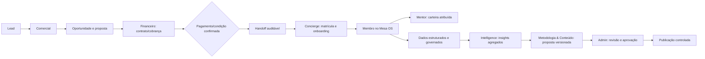
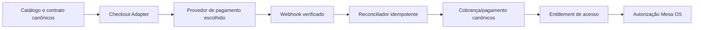

# Operating Model R2 — Backoffice, Receita e Intelligence

**Status:** PROPOSAL — requer Definition Pack de BUILD específico

## Direção consolidada

A operação da Mesa dos Donos terá três domínios independentes, conectados somente por contratos auditáveis:

1. **Relacionamento:** CRM, comercial, onboarding, mentoria e carteira.
2. **Receita:** catálogo, contrato, checkout, cobrança, pagamento, acesso contratado e conciliação.
3. **Intelligence:** leitura agregada e governada para melhorar conteúdo, ferramentas, ciclos e operação — sem alterar o produto por conta própria.

O membro continua fora do backoffice. Nenhum dos três domínios se torna fonte paralela da metodologia, nem permite ao TutorIA ou à IA alterar dados críticos sem política e aprovação humana.

## Equipe ideal e responsabilidades

| Função | Responsabilidade principal | Poderes efetivos | Não pode fazer por padrão |
| --- | --- | --- | --- |
| Donos/Admins | governança, estratégia, responsáveis, exceções e aprovações | atribuir funções, aprovar mudanças, revisar indicadores e exceções | ver conteúdos sensíveis ou agir como membro sem justificativa/auditoria |
| Comercial | aquisição e fechamento | leads, contas, contatos, oportunidades, atividades, proposta e handoff | acessar contexto metodológico, TutorIA ou evolução do membro |
| Concierge | entrada e sucesso operacional inicial; incorpora a rotina antes chamada de Operador | handoff, matrícula/revogação autorizada, onboarding, pendências e encaminhamentos | mudar metodologia, ciclo, avaliação ou memória TutorIA |
| Mentor | apoio humano à evolução da comunidade de membros | visão metodológica global mínima, pedidos de orientação e escalonamentos | dados comerciais irrelevantes, chat bruto ou decisões autônomas |
| Financeiro | receita, contratos, cobranças, conciliação e exceções financeiras | catálogo comercial, contrato, status financeiro, estorno/reembolso conforme alçada | dados de pagamento sensíveis, evolução metodológica ou contexto TutorIA |
| Metodologia & Conteúdo | qualidade da Jornada, ferramentas, ciclos e materiais | elaborar rascunhos versionados, revisar propostas e publicar após aprovação | reescrever histórico, alterar produção sem governança ou usar dados identificáveis livremente |
| Intelligence | análises agregadas, hipóteses e recomendações para a Mesa | consultar conjuntos aprovados e desidentificados, gerar relatórios e propostas | identificar membros, alterar conteúdo/metodologia, executar ações ou treinar modelos implicitamente |
| TI/Plataforma | disponibilidade, segurança, integrações e observabilidade | operar segredos, deploys, incidentes e saúde técnica | consultar conteúdo de negócio ou dados pessoais por conveniência |

Uma pessoa pode acumular funções em uma fase inicial, mas o sistema grava qual capability foi usada em cada ação. O cargo **Operador** deixa de existir; suas permissões de matrícula e rotina passam para Concierge, sem acesso adicional a dados metodológicos.

## Fluxo integrado da operação

O retorno de Intelligence nunca pula a etapa de Metodologia & Conteúdo nem a aprovação de Admin. Uma recomendação não altera fórmula, ferramenta, ciclo, conteúdo, interface ou dados históricos automaticamente.

## Receita, checkout e faturamento: arquitetura preparada

### Núcleo financeiro canônico

O domínio financeiro deve ser portátil e não depender de um único checkout. As fontes canônicas propostas são:

- **Produto/oferta e preço versionado:** o que é vendido, vigência, moeda, condição comercial e elegibilidade.
- **Proposta e contrato:** cliente, itens, status, datas, descontos autorizados e responsável.
- **Assinatura/direito de acesso:** o que foi contratado e até quando; não é determinado pela tela de checkout.
- **Cobrança/fatura:** valor devido, vencimento, estado e referência externa.
- **Pagamento e conciliação:** evento confirmado, valor, método e estado; correções/estornos como novos fatos auditáveis.
- **Entitlement de acesso:** direito efetivo que libera ou restringe o serviço, derivado somente de contrato/pagamento confirmado e regras aprovadas.

Cartão, dados bancários, PIX sensível ou outros meios de pagamento não devem transitar nem permanecer no Mesa OS. Eles ficam exclusivamente no provedor compatível escolhido. O Mesa OS armazena apenas referências mínimas, estado, valores e evidências de conciliação necessárias.

### Camada de integração de cobrança

- O checkout é um **adaptador**, portanto o provedor pode ser substituído sem reescrever contratos, cobranças ou direitos de acesso.
- Webhook assinado e idempotente é a fonte de confirmação. Retorno do navegador, screenshot ou mensagem não libera acesso.
- Status de pagamento e acesso são independentes: uma regra explícita decide tolerância, inadimplência, suspensão, exceção e reativação.
- Financeiro opera exceções por alçada; nenhum estorno, desconto ou suspensão acontece sem registro e política.
- Relatórios financeiros operacionais serão reconciliação e controle; contabilidade/fiscal oficial permanece no sistema contábil/fiscal apropriado, salvo pack específico posterior.

### Capacidades financeiras propostas

| Capability | Admin | Financeiro | Comercial | Concierge | TI |
| --- | --- | --- | --- | --- | --- |
| manter catálogo/preço | aprova | propõe conforme alçada | leitura | leitura mínima | não |
| criar proposta comercial | leitura/override auditado | leitura | própria/atribuída | não | não |
| registrar contrato | aprova exceções | cria/atualiza conforme alçada | solicita | leitura de status | não |
| criar cobrança/checkout | aprova exceções | sim | solicita | não | opera integração, sem valores por conveniência |
| conciliar pagamento | leitura | sim | leitura de status | leitura de elegibilidade | saúde técnica somente |
| liberar/restringir entitlement | aprova exceção | por regra e alçada | não | solicita | não |
| reembolso/estorno | aprova fora da alçada | por política | solicita | não | não |

## Mesa OS Intelligence: quem usa e quem decide

**Intelligence é uma capacidade interna de apoio à decisão, não um administrador automático.** Seus usuários principais são:

- **Intelligence:** opera análises e prepara relatórios/propostas a partir de dados permitidos.
- **Metodologia & Conteúdo:** transforma recomendações em rascunhos de ferramenta, treinamento, conteúdo, mapa ou ciclo.
- **Donos/Admins:** aprovam prioridades, investimento e publicação.
- **Mentores/Concierge/Comercial:** fornecem feedback operacional estruturado e usam análises pertinentes à sua função, sem acesso a dados de outras carteiras.
- **TI/Plataforma:** garante qualidade de dados, custo, observabilidade, isolamento e segurança; não decide metodologia.

### O que Intelligence poderá fazer, quando autorizado

- detectar tendências agregadas de lacunas, avanços, abandono, uso de ferramentas e demandas recorrentes;
- sugerir temas de encontros, materiais, treinamentos, melhorias de ferramenta e hipóteses de ciclo;
- comparar versões metodológicas usando coortes agregadas e critérios aprovados;
- priorizar propostas internas por impacto esperado, confiança e custo;
- gerar rascunhos internos de conteúdo, sempre rotulados como proposta e revisados por pessoas responsáveis.

### O que Intelligence nunca poderá fazer sozinha

- identificar ou expor um membro a outra organização;
- usar chat bruto, dados sensíveis ou informação identificável fora da finalidade autorizada;
- alterar o Mapa 4 × 4, fórmulas, critérios de aprovação, ciclos ou ferramentas;
- publicar conteúdo, enviar comunicação, mudar acesso, preço ou cobrança;
- treinar/fine-tunar modelos com dados de membros sem base legal, opt-in quando necessário, política própria e aprovação;
- tomar decisão individual de alto impacto sem regra, humano responsável e trilha de auditoria.

### Ciclo de melhoria governada

1. Dados canônicos produzem métricas e conjuntos agregados com limiar mínimo de coorte.
2. Intelligence produz um insight com fonte, confiança, limitação e impacto esperado.
3. Metodologia & Conteúdo elabora um rascunho versionado.
4. Admin/Council revisa impacto metodológico, privacidade, custo e compatibilidade histórica.
5. A mudança aprovada entra em Definition Pack, migration/versionamento, testes e promoção controlada.
6. Resultado é medido; Intelligence compara a versão nova com a anterior sem reescrever história.

## Roadmap recomendado

| Bloco | Resultado | Não inclui |
| --- | --- | --- |
| OPS-3.0A | CRM comercial, handoff e Concierge com matrícula/onboarding | dados metodológicos, canais externos |
| FIN-3.1A | contratos, catálogo, cobrança e entitlement sem provedor | checkout real, cartão, webhook |
| FIN-3.1B | primeiro checkout oficial e conciliação em homologação | contabilidade/fiscal, múltiplos provedores |
| OPS-3.0B | carteira de Concierge com envelope autorizado; base de Mentor sujeita a adendo próprio | chat bruto, acesso global técnico antes de adendo |
| INT-3.2A | camada agregada de Intelligence e propostas internas | atualização automática, dados identificáveis livres |
| COM-3.3A | WhatsApp/Instagram oficiais por adaptador | automação sem consentimento, disparo em massa |

## Guardrails obrigatórios

- RBAC por capability, RLS, auditoria, revisão periódica e revogação imediata.
- Segredos apenas em cofre por ambiente; nenhum dado de pagamento em browser, Git, logs ou banco Mesa OS.
- Webhooks verificados, eventos idempotentes e plano de rollback por integração.
- Versionamento e compatibilidade explícita para metodologia, ferramentas, ciclos e conteúdo.
- Agregação, minimização, finalidade, retenção e revisão jurídica antes de qualquer uso de dados de membros por Intelligence.
- Mudanças materiais sempre entram por Definition Pack, Pre-Flight, testes, homologação e promoção explícita.

## Próxima decisão necessária

Este modelo não autoriza código. O próximo passo seguro é aprovar o Definition Pack OPS-3.0A R2 para CRM comercial e handoff Comercial → Concierge; Financeiro/checkout e Intelligence continuam blocos próprios subsequentes. Após a aprovação, o owner poderá autorizar BUILD somente do OPS-3.0A R2.
